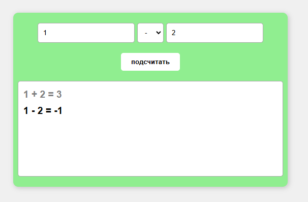

# Безопасность веб-приложений. Лабораторка №1

Выполнила Белякова Вероника 6411

## Основное задание

Сделать одностраничное автономное браузерное приложение "Калькулятор".
На странице должно быть два поля ввода для чисел и выбор операции между ними.

По нажатию на кнопку должен вычисляться результат и выводиться в текстовое поле.
Приложение должно контролировать формат вводимых значений и по необходимости сообщать об ошибке.

